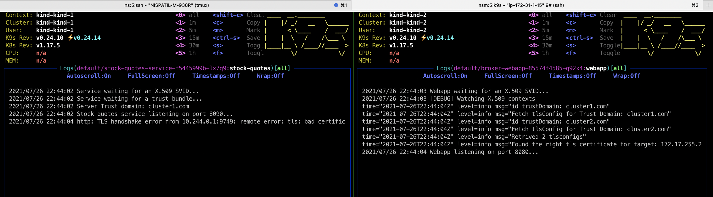
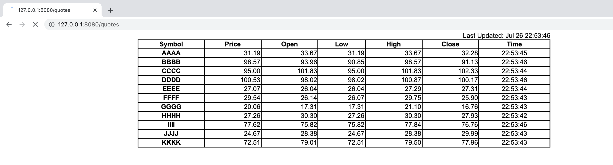

# Spire Federation using Kind Clusters

[](https://github.com/nishantapatil3/spire-federation-kind/actions/workflows/release.yml)

> **Note:** Check out this Cisco Blog for Intro on: [SPIFFE/SPIRE Federation on Kind clusters](https://outshift.cisco.com/blog/spire-federation-kind)

Spire Federation provides zero trust security of workloads in kubernetes clusters and is wide adopted by cloud service
providers.

In this example we will create two kind clusters and set them up with trust domains `cluster1.com` and `cluster2.com`

Then we will use the examples provided in spire official example and modify the docker container to be suitable
for kubernetes deployment.

Source: [Spire federation example](https://github.com/spiffe/spire-tutorials/tree/master/docker-compose/federation)

The above example is based on docker-compose and federation between two docker containers. But this repo is an enhancement
the official example to bring spiffe/spire security for kubernetes clusters.

# Federation Example

## Requirements

Required files for this tutorial can be found in the `docker-compose/federation` directory in https://github.com/spiffe/spire-tutorials. If you didn't already clone the repository please do so now.

Before proceeding, review the following system requirements:
- A 64-bit Linux or macOS environment
- [kind](https://kind.sigs.k8s.io/) to deploy kubernetes clusters and [kubectl](https://kubernetes.io/docs/tasks/tools/) to execute commands on deployments
- [Docker](https://docs.docker.com/get-docker/) and [Docker Compose](https://docs.docker.com/compose/install/) installed (Docker Compose is included in macOS Docker Desktop)
- [helm](https://helm.sh/) charts - to manage Kubernetes applications
- [Go](https://golang.org/dl/) 1.14.4 or higher installed

## Build

**Note:** There are some known issues with Mac's Docker networking and kind clusters's metallb networking being incompatible, so this article is written for `linux/amd64` platform and Docker images are built for `linux/amd64` by default.

Ensure that the current working directory is spire-federation-kind and run the following command to build

Optionally: push containers to your cloud repository.

```bash
$ ./build.sh
```

Create two kind clusters
```bash
kind create cluster --name kind-1
kind create cluster --name kind-2

mkdir -p $PWD/kubeconfigs
kind get kubeconfig --name=kind-1 > $PWD/kubeconfigs/kind-1.kubeconfig
kind get kubeconfig --name=kind-2 > $PWD/kubeconfigs/kind-2.kubeconfig
```

Add $cluster1 and $cluster2 to your env
```
source lab_clusters.sh
```

Wait until the clusters deploy on your setup, then deploy metallb for load balancing such that two clusters
can reach each other by their external IP's

> **Note:** `172.17.*` address might be different on your docker network for kind, check that and replace with your IPAM address in below metallb and spire config.
Check `docker network inspect kind` on your device

```bash
helm repo add metallb https://metallb.github.io/metallb

export KUBECONFIG=$cluster1
kubectl create ns metallb-system
helm install metallb metallb/metallb --namespace metallb-system

export KUBECONFIG=$cluster2
kubectl create ns metallb-system
helm install metallb metallb/metallb --namespace metallb-system
unset KUBECONFIG

kubectl apply -f helm/metallb-system/ipaddresspool1.yaml --kubeconfig $cluster1
kubectl apply -f helm/metallb-system/ipaddresspool2.yaml --kubeconfig $cluster2
```

Deploy spire server and agent
```bash
helm template helm/spire --set trustDomain=cluster1.com --set federatesWith[0].trustDomain=cluster2.com --set federatesWith[0].address=172.17.254.1 --set federatesWith[0].port=8443 | kubectl apply --kubeconfig $cluster1 -f -
helm template helm/spire --set trustDomain=cluster2.com --set federatesWith[0].trustDomain=cluster1.com --set federatesWith[0].address=172.17.255.1 --set federatesWith[0].port=8443 | kubectl apply --kubeconfig $cluster2 -f -
```

> **Note:** if using zsh append `noglob` before `helm command`

Run the following command to [bootstrap the federation](https://github.com/spiffe/spire-tutorials/blob/master/docker-compose/federation/README.md#bootstrap-federation):
```bash
./2-bootstrap.sh
```

Run the following command to create [workload registration entries](https://github.com/spiffe/spire-tutorials/blob/master/docker-compose/federation/README.md#create-registration-entries-for-federation):
```bash
./3-register.sh
```

Deploy Server
```bigquery
kubectl apply -f helm/server.yaml --kubeconfig $cluster1
```
Deploy client

> Note: Update this field in client.yaml after checking the correct IP address of server (this may change based on your MetalLB config)
```
env:
- name: QUOTES_SERVICE_HOST
    value: "172.17.254.2" # Update this IP with stock-quotes-service external IP address
```
```
kubectl apply -f helm/client.yaml --kubeconfig $cluster2
```

## See the Scenario Working In a Browser

Port forward the client pod to your localhost:8080 using kubectl

Example:
`kubectl port-forward broker-webapp-85574f4585-cxvxg 8080:8080 --kubeconfig $cluster2`

Open up a browser to http://localhost:8080/quotes and you should see a grid of randomly generated phony stock quotes that are updated every 1 second.



